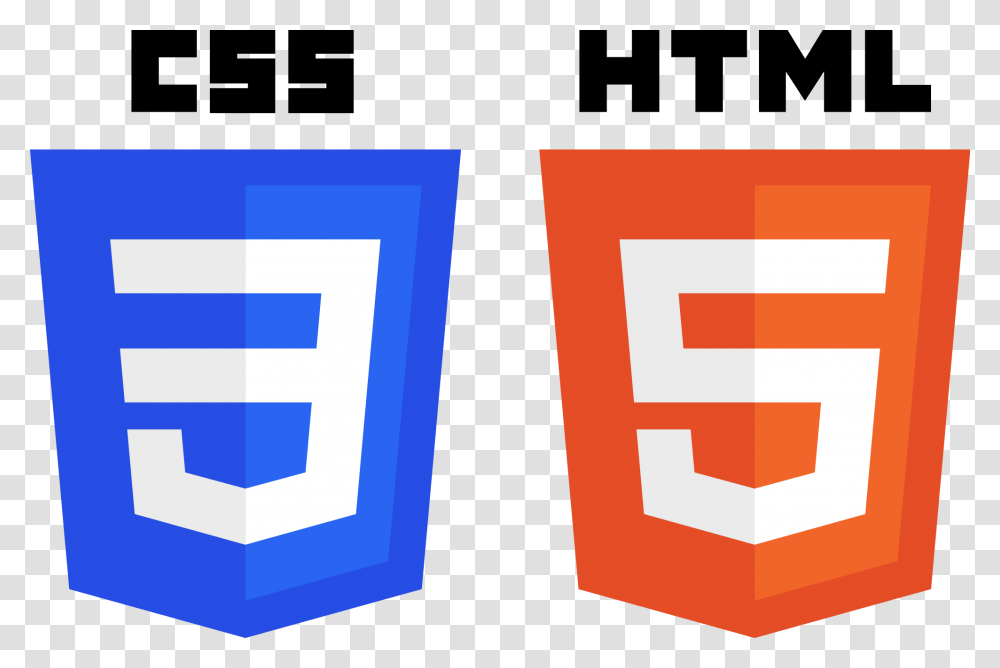

# Hello, I'm Jhoel 👋 

- 🌱 I’m currently learning Web Development.
- 🐍 Working on becoming a Python master.
- 🥅 2022 Goals: Develop beautiful Front End Applications and web3 Software.

### Languages and Tools

 

### 🖥 Latest Programming Projects 

<!-- BLOG-POST-LIST:START -->
- [Cheapest Flight Available - Python Tool](https://github.com/jhoeljp/Python/tree/main/Flight_Club)
- [Password Manager GUI](https://github.com/jhoeljp/Python/tree/main/Password_Manager)
- [Pomodoro Study Aid GUI](https://github.com/jhoeljp/Python/tree/main/pomodoro_GUI)
- [Stock News Tool ](https://github.com/jhoeljp/Python/tree/main/Stock_News)
<!-- BLOG-POST-LIST:END -->

  
:zap: GitHub Stats

  

[instagram]: https://www.instagram.com/jhoeljp/
[linkedin]: https://www.linkedin.com/in/jhoeljp/
[tableau]: https://jhoeljp.github.io/CV/